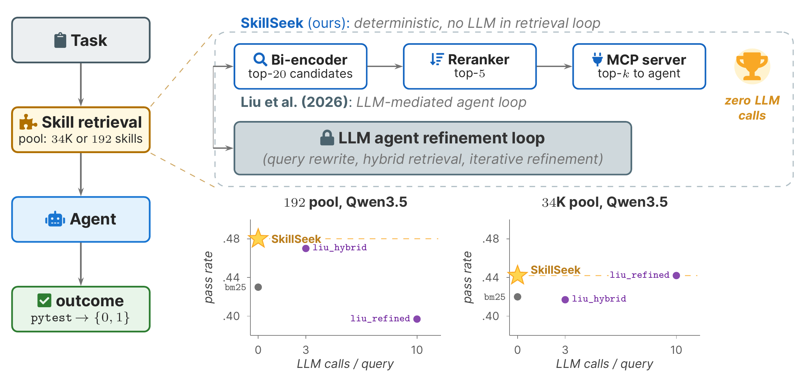

# SkillSeek: Revisiting Agent Skill Retrieval at Marketplace Scale



[Agent Skills](https://github.com/agentskills/agentskills) package procedural know-how as `SKILL.md` folders, and public collections now hold tens of thousands of them. An agent cannot read a pool that large, so something has to choose which skills it sees. A common answer lets the agent search with its own LLM loop, which spends tokens on every task.

SkillSeek makes that choice with a standard two-stage retriever and serves it over the Model Context Protocol (MCP), so any MCP-capable agent can use it without code changes. A BGE-base bi-encoder shortlists 20 skills, the bge-reranker-v2-m3 cross-encoder reorders them, and the agent reads the top `k`. Retrieval calls no LLM, and the reranker runs on CPU by default.

Setting it up takes the three steps below. [docs/configuration.md](docs/configuration.md) lists the server's settings and the profile builder's options, [docs/reproduce.md](docs/reproduce.md) explains how to rerun the experiments, and [liu_baseline/](liu_baseline/) holds our reimplementation of the Liu et al. (2026) baseline.

## Install the Server With pip

SkillSeek needs Python 3.12. Install it into a virtual environment:

```bash
git clone https://github.com/guanqun-yang/SkillSeek && cd SkillSeek
python -m venv .venv && source .venv/bin/activate
pip install -r requirements.txt
```

## Point the Server at Your Skill Folder

The server indexes each `<skill>/SKILL.md` under `SKILLS_DIR` by name and description. To register it with Claude Code over stdio, run:

```bash
claude mcp add skillseek \
  -e SKILLS_DIR=/path/to/skills -e MCP_TEXT_VARIANT=baseline \
  -- /path/to/SkillSeek/.venv/bin/python /path/to/SkillSeek/mcp_server/skills_mcp.py
```

To share one server among several agents or containers, start it over HTTP and register the URL:

```bash
SKILLS_DIR=/path/to/skills MCP_TEXT_VARIANT=baseline MCP_TRANSPORT=http MCP_PORT=8002 \
  python mcp_server/skills_mcp.py
claude mcp add --transport http skillseek http://localhost:8002/mcp
```

The agent then sees three tools:

- `skill_lookup(query, k)` returns the `k` best-matching skills, 3 unless the agent asks for more.
- `skill_load(name)` returns the full `SKILL.md` of one skill.
- `skill_list()` returns the name and description of each skill in the pool.

## Add Tool-REX Profiles for Large Pools

On large pools, retrieval usually improves when each skill is also indexed by a short [Tool-REX](https://github.com/EIT-NLP/Tool-DE) profile: a one-sentence function description and four tags that name its file type and main operation. The profiles for the SkillsBench pool and the 34K pool of Liu et al. ship in `data/`. For your own pool, an LLM writes them once, offline:

```bash
export OPENROUTER_API_KEY=...
python scripts/build_toolrex_profiles.py --pool /path/to/skills --out data/toolrex_profiles_mine.json
SKILLS_DIR=/path/to/skills MCP_TOOLREX_PATH=data/toolrex_profiles_mine.json python mcp_server/skills_mcp.py
```

The builder works with OpenRouter, Anthropic, OpenAI, Gemini, Kimi, Z.ai, MiniMax, and local vLLM models. Its options are in [docs/configuration.md](docs/configuration.md).
